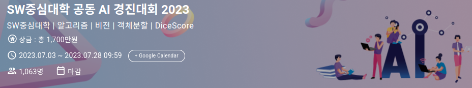

# SW중심대학 공동 AI 경진대회 2023 - Satellite Image Segmentation
This repository contains the solution for the 2023 SW-centered University Joint AI Competition hosted by DACON ([Competition Link](https://dacon.io/competitions/official/236092/overview/description)). Our team achieved top performance in satellite image segmentation.

# 📝 Overview
- **Participants**: Seungchan Kwon, Doeon Kim, Minwoo Kim, Jungyoon Lee, Gyuil Lim
- **Task**: Improve segmentation performance on satellite image datasets.
- **Competition**: SW중심대학 공동 AI 경진대회 2023 (DACON).

# ✨ Key Details
- **Models Used**: U-Net++, SegFormer
- **Core Methods**:
  - Test-Time Augmentation (TTA)
  - Soft Voting Ensemble
- **Scores**:
  - Public Score: 0.82683
  - Private Score: 0.82541
